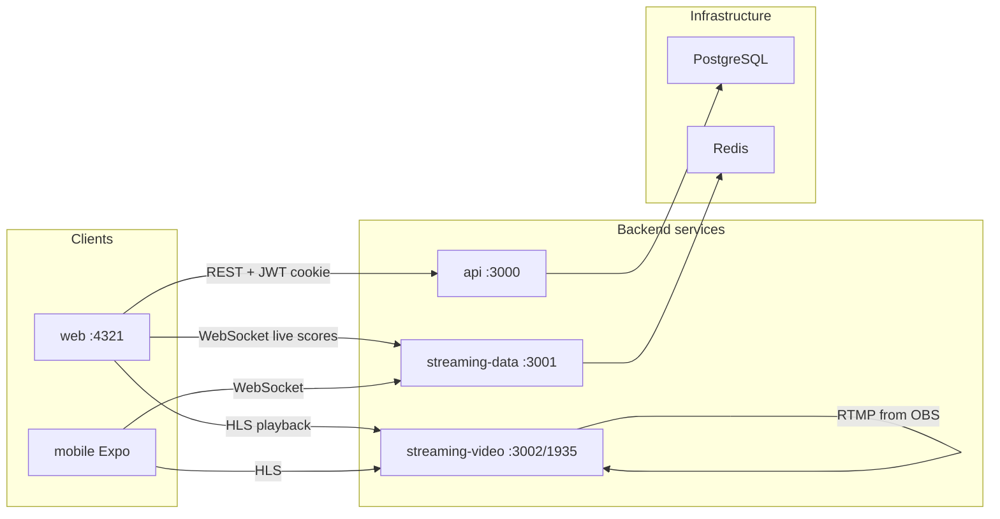

# Apps

Parches is a **pnpm monorepo** for a sports tournament marketplace with live match streaming. The root [`package.json`](../package.json) runs all apps in parallel via `pnpm dev`. Shared code lives in [`packages/`](../packages/) (`@parches/types`, `@parches/config`, `@parches/utils`).



---

## 1. [`web`](web/) — Marketplace frontend (Astro SSR)

**Stack:** Astro 4 + React islands + Tailwind + Node adapter (SSR on port **4321**)

**Purpose:** Public-facing website where users browse tournaments, watch live matches, and manage profiles.

### Pages (`web/src/pages/`)

| Route | Role |
|-------|------|
| `/` | Home marketplace: hero carousel, live strip, tournament rows by sport |
| `/tournaments/[slug]` | Tournament detail (standings, **equipos**, fixture, stats) |
| `/matches/[id]` | Live match page: scoreboard, video, event feed |
| `/users/[id]`, `/profile` | Player/user profiles |
| `/teams/[id]` | Team page: plantilla, partidos, estadísticas |
| `/login`, `/register`, `/auth/logout` | Auth flow |

### Architecture pattern

- **SSR shell** in `.astro` files (SEO, layout, static structure)
- **React islands** for live interactivity (`client:load`):
  - `LiveScoreboard.tsx` — WebSocket score updates
  - `VideoPlayer.tsx` — HLS stream
  - `EventFeed.tsx` — referee events
  - `MatchStatsPanel.tsx` — match statistics

- **Layout:** `Base.astro` — SEO head, optional auth, navbar, footer

### Data source today: mock, not API

Most pages import from `web/src/data/mock.ts` (~765 lines of Colombian-style tournament data). Comments in page files describe swapping for real API calls:

```typescript
// index.astro — intended future wiring:
import { getTournaments } from '../lib/api';
const tournaments = await getTournaments(Astro.request);
```

The API client (`lib/api.ts`) and auth (`lib/auth.ts`) are already built — JWT in httpOnly cookie, `getOptionalUser` / `requireAuth`, typed fetch to `@parches/api`.

### Notable details

- `SportIcon.astro` uses Disney CDN placeholder images for sport icons (not local SVGs)
- Favicon in `Base.astro` currently points to the football Disney CDN asset (same as `SportIcon` football); local `/favicon.svg` is not present in the repo

### Dev

```bash
pnpm dev:web   # port 4321
```

---

## 2. [`api`](api/) — Main REST API (Fastify + Prisma)

**Stack:** Fastify 4, Prisma, PostgreSQL, JWT (port **3000**)

**Purpose:** Source of truth for users, tournaments, teams, matches, and persisted events.

### Routes (`api/src/`)

| Prefix | Endpoints | Notes |
|--------|-----------|-------|
| `/auth` | `POST /register`, `POST /login`, `GET /me` | Email-only login (no password hash yet — dev simplification) |
| `/tournaments` | `GET /`, `GET /:id`, `POST /` | List/create tournaments with teams & matches |
| `/matches` | `GET /:id`, `PATCH /:id` | Match detail + score/status updates |
| `/health` | health check | |

### Database model (`api/prisma/schema.prisma`)

- **Users** with roles: `VIEWER`, `PLAYER`, `REFEREE`, `ORGANIZER`, `ADMIN`
- **PlayerProfile** + **PlayerEnrollment** (player ↔ team ↔ tournament)
- **PlayerTournamentStat** / **PlayerMatchStat** — sport-agnostic stats via `Json` columns
- **Tournament**, **Team**, **Match** (with `streamKey`, `hlsUrl`, referee link)
- **MatchEvent** — referee events with typed payload

This is the most complete backend piece; the web UI has not been wired to it yet for listing pages.

### Dev

```bash
pnpm dev:api
pnpm db:migrate    # from repo root
pnpm db:generate
```

Requires `DATABASE_URL` and `JWT_SECRET` in `.env`.

---

## 3. [`streaming-data`](streaming-data/) — Real-time match events (WebSocket)

**Stack:** Fastify + `@fastify/websocket` + Redis pub/sub (port **3001**)

**Purpose:** Low-latency live score and referee events — **separate from video** by design.

### How it works

1. Clients connect: `ws://localhost:3001/matches/:matchId/ws`
2. Referee/mobile posts events: `POST /matches/:matchId/events` with a `RefereeEvent` body
3. `broadcastEvent` in `ws/handler.ts` publishes to Redis channel `match:{matchId}`
4. All server instances subscribe and fan out to their local WebSocket clients

Redis pub/sub supports **horizontal scaling** — multiple `streaming-data` instances share the same event bus.

### Consumers

- Web: `LiveScoreboard`, `EventFeed`, `lib/streaming-client.ts`
- Mobile: `mobile/src/lib/useMatchStream.ts`

### Dev

```bash
pnpm dev:streaming-data
```

Requires `REDIS_URL` (default `redis://localhost:6379`).

---

## 4. [`streaming-video`](streaming-video/) — RTMP ingest → HLS

**Stack:** `node-media-server` + ffmpeg (RTMP **1935**, HTTP **3002**, management API **3003**)

**Purpose:** Accept RTMP push from OBS/encoders, transcode to HLS segments, serve manifests for playback.

### Flow

```
OBS/encoder --RTMP:1935--> node-media-server --ffmpeg--> HLS segments in ./media
Browser/mobile <--HTTP:3002-- index.m3u8 + .ts segments
```

- Stream keys tie to `Match.streamKey` in the database
- `GET /stream/:streamKey/hls` returns the HLS manifest URL
- **Requires ffmpeg** on the host (configured as `/usr/bin/ffmpeg`)

Video and data are intentionally split: scores/events never go through the video pipeline.

### Dev

```bash
pnpm dev:streaming-video
brew install ffmpeg   # macOS
```

---

## 5. [`mobile`](mobile/) — Spectator app (Expo)

**Stack:** Expo 51, React Native, expo-router

**Purpose:** Mobile viewing experience for live matches.

### Current state: scaffold

- `WatchScreen.tsx` — score + live connection status
- `useMatchStream.ts` — WebSocket hook to `streaming-data`
- `hlsUrl` prop is accepted but video player is not wired in `WatchScreen` yet
- No expo-router `app/` pages in the tree yet — early-stage shell

The referee-facing app lives outside `apps/` in [`ios-native/`](../ios-native/) (Swift/Xcode).

### Dev

```bash
cd apps/mobile && pnpm start
```

---

## Cross-app contracts (`packages/`)

| Package | Role |
|---------|------|
| `@parches/config` | Ports (4321, 3000, 3001, 3002) and env-based endpoint URLs |
| `@parches/types` | Shared TS: `Tournament`, `Match`, `RefereeEvent`, `WSMessage`, etc. |
| `@parches/utils` | `formatScore`, `formatClock`, `getPeriodLabel`, event helpers |

---

## Maturity assessment

| App | Maturity | Gap |
|-----|----------|-----|
| **web** | UI rich, UX designed | Still on mock data; API/auth wired but unused on main pages |
| **api** | Schema + core routes | Auth has no password; no seed data script |
| **streaming-data** | WS + Redis pub/sub complete | Needs referee client to POST events (`ios-native` backlog) |
| **streaming-video** | RTMP/HLS pipeline defined | Hardcoded ffmpeg path; needs production config |
| **mobile** | Hook + screen stub | No navigation shell, no video player integration |

---

## End-to-end flow (intended)

1. **Organizer** creates tournaments/teams/matches via `api`
2. **Referee** (ios-native app) posts live events → `streaming-data` → WebSocket → web/mobile scoreboards
3. **Broadcaster** pushes RTMP to `streaming-video` with match stream key → viewers watch HLS in `VideoPlayer`
4. **Spectators** browse marketplace on `web`, open match page, see live score + stream + event feed
5. **Users** register/login via `api`, JWT stored in cookie, profile pages protected with `requireAuth`

**Today:** Steps 1 and 4–5 are partially built; steps 2–3 infrastructure exists but browsing UI runs on mocks and mobile/referee clients are thin.

---

## Run everything

```bash
pnpm install
cp .env.example .env   # configure DATABASE_URL, JWT_SECRET, REDIS_URL
pnpm db:migrate
pnpm dev               # all apps in parallel
```

See the root [README](../README.md) for full environment variables and commands.
